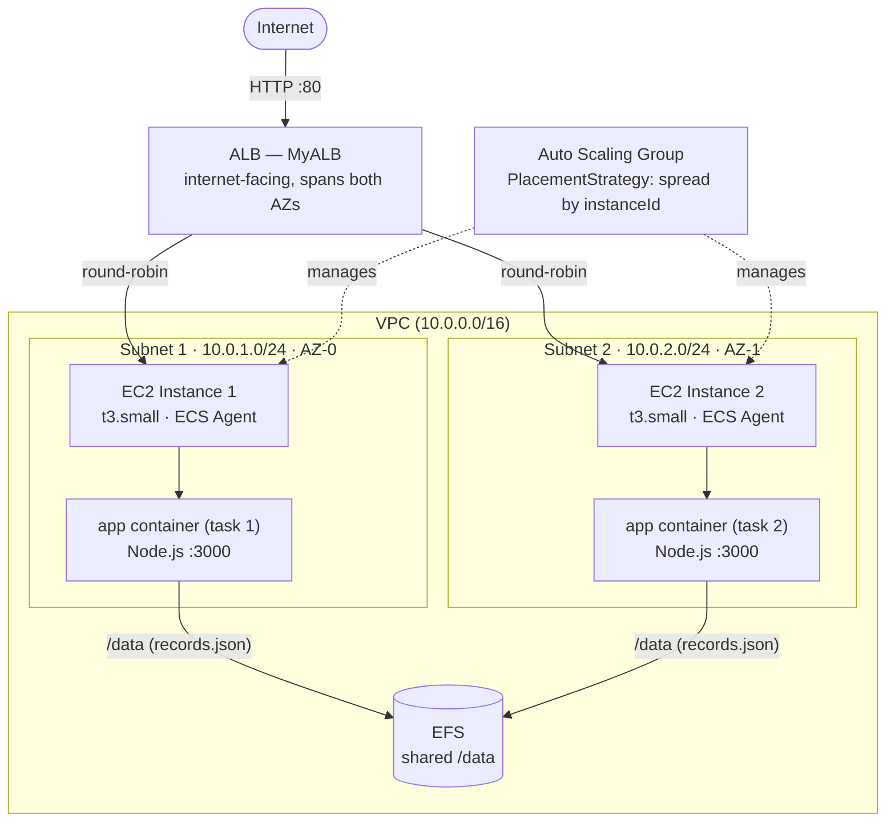

# ECS Hello World — Infrastructure Design

Template: `cf/ecs-ec2-multi-node-cf.yaml`

---

## What this creates

| Resource | Count | Notes |
|---|---|---|
| VPC + Subnets + IGW | 1 VPC, 2 subnets | Stack-owned, no pre-existing networking needed |
| ECS Cluster | 1 | `MyECSCluster` |
| Auto Scaling Group | 1 | 2 `t3.small` instances across 2 AZs |
| EFS File System | 1 | Shared log storage, survives instance replacement |
| ECS Service | 1 | 2 `nginx` tasks, spread across instances |
| Application Load Balancer | 1 | Single DNS entry point, round-robins across both tasks |
| IAM Role | 1 | ECS registration + SSM access (no SSH needed) |

---

## Architecture



> EC2 security group: port 80 from ALB only — no direct internet access to instances.

---

## Key Concepts

### Why Auto Scaling Group instead of bare EC2 instances

Bare `AWS::EC2::Instance` resources cannot be replaced gracefully — CloudFormation terminates them immediately, killing any running containers with no warning.

An ASG with a rolling update policy handles AMI upgrades without downtime:

```yaml
# ecs-ec2-multi-node-cf.yaml — MyASG
UpdatePolicy:
  AutoScalingRollingUpdate:
    MaxBatchSize: 1           # Replace one instance at a time
    MinInstancesInService: 1  # Always keep at least 1 running
    PauseTime: PT2M           # Wait 2 min after new instance joins before continuing
```

Rolling upgrade flow:
1. Update `ImageId` in `MyLaunchTemplate` and run `cloudformation deploy`
2. ASG launches 1 new instance (new AMI) — cluster temporarily has 3 instances
3. ECS reschedules tasks onto the new instance
4. Old instance is drained and terminated
5. Repeat for the second instance

To trigger an AMI upgrade, change only this line in `MyLaunchTemplate`:

```yaml
# ecs-ec2-multi-node-cf.yaml — MyLaunchTemplate
ImageId: 'ami-0c55b159cbfafe1f0'  # <- replace with new AMI ID
```

---

### Why EFS for log persistence

Container logs written to the EC2 host filesystem are lost when an instance is terminated — which happens during AMI upgrades, scaling events, or failures.

EFS is a distributed network filesystem (NFS) — not a single physical disk. AWS replicates its data across multiple AZs internally. The two mount targets in this template are simply **network entry points** into that distributed system, one per AZ. There is one logical filesystem, accessible from both instances simultaneously.

```
EFS (distributed internally across AZs)
           ↑                      ↑
 MountTarget (AZ-0)       MountTarget (AZ-1)    ← access points, not separate disks
           ↑                      ↑
    EC2 Instance 1          EC2 Instance 2
```

nginx logs are mapped from inside the container through the host and into EFS:

```
nginx container /var/log/nginx
        ↓  (MountPoint in task definition)
EC2 host /ecs/logs/nginx
        ↓  (EFS mount via /etc/fstab in UserData)
EFS FileSystem  ← persists independently of any EC2
```

Both instances write to EFS concurrently without contention because each nginx instance writes its own log stream — they are not writing to the same file simultaneously. NFS locking only becomes a concern when multiple writers target the same file.

---

#### Storage options compared

| | Local disk (instance store) | EBS | EFS |
|---|---|---|---|
| Latency | ~0.1ms | ~0.5ms | ~1–3ms |
| Throughput | Very high | High | Moderate |
| Shared across instances | No | No | Yes |
| Survives instance termination | No | Yes | Yes |

**Why not EBS?**
EBS is a block device attached to a single EC2 instance — it cannot be mounted by two instances at the same time (Multi-Attach exists but is limited to specific volume types and use cases, and is not suitable for a general shared filesystem). When an instance is terminated and replaced by the ASG, the EBS volume is detached and the new instance gets a fresh one. You would have to manually re-attach and re-mount the old volume, which defeats the purpose of automated rolling upgrades.

**Why EFS is fine here despite network overhead:**
nginx buffers log writes and flushes periodically — it is not doing random low-latency I/O. The 1–3ms network overhead of EFS is irrelevant for log workloads. The penalty would matter for databases, caches, or high-throughput binary I/O.

---

#### Alternatives if you needed more than EFS

| Approach | How | When to use |
|---|---|---|
| **EFS** (current) | Shared NFS mount, no extra agents | Simple log persistence, small-to-medium volume |
| **Fluent Bit sidecar** | Container alongside nginx reads its log files and ships to S3 or CloudWatch | Production: searchable, queryable logs at scale; decouples log storage from instance lifecycle entirely |
| **Local disk + accept loss** | No persistence, logs only available while instance is running | Fine if logs are only needed for live debugging, not audit or analysis |

A Fluent Bit sidecar would run as a second container in the same ECS task, sharing a volume with nginx, and stream logs out in real time — no EFS needed at all. That is the production pattern when log durability and queryability matter.

---

The task definition wires this up:

```yaml
# ecs-ec2-multi-node-cf.yaml — MyTaskDefinition
Volumes:
  - Name: nginx-logs
    Host:
      SourcePath: '/ecs/logs/nginx'   # on EC2 host, backed by EFS
ContainerDefinitions:
  - MountPoints:
      - SourceVolume: nginx-logs
        ContainerPath: '/var/log/nginx'  # inside the container
```

The EFS mount is set up on every instance via UserData in `MyLaunchTemplate`:

```bash
yum install -y amazon-efs-utils
mkdir -p /ecs/logs/nginx
echo "${EFSFileSystemId}:/ /ecs/logs efs defaults,_netdev 0 0" >> /etc/fstab
mount -a
```

---

### Why two subnets across two AZs

Each subnet is pinned to one physical Availability Zone (a separate AWS data centre). The ASG spreads instances across both subnets so a single AZ failure only takes down one instance, not both.

```yaml
# ecs-ec2-multi-node-cf.yaml — MyASG
VPCZoneIdentifier:
  - !Ref MySubnet1   # AZ 0
  - !Ref MySubnet2   # AZ 1
```

It is possible to use a single subnet (both instances in the same AZ), but losing that AZ would take down the entire cluster.

---

### Traffic distribution — ALB round-robin across both instances

The ALB provides a single DNS name and distributes requests across both EC2 instances in round-robin order. Clients never need to know individual instance IPs.

```
Client → ALB DNS (port 80)
              ↓
    ALB Listener (HTTP:80)
              ↓
    Target Group (instance mode)
         /          \
EC2 Instance 1    EC2 Instance 2
  nginx (task 1)   nginx (task 2)
```

The `PlacementStrategies: spread by instanceId` in the ECS service is about **task placement**, not request routing — it guarantees ECS places exactly 1 nginx task per EC2 instance. Because there is 1 task per instance and the target group uses instance mode with port 80, the ALB routes to one instance per request, alternating between them.

**Security:** EC2 instances are no longer directly reachable from the internet on port 80. The EC2 security group only allows port 80 from the ALB security group. All client traffic must flow through the ALB.

**Cost:** ALB adds ~$0.008/hr base + LCU charges (negligible at this traffic volume). See cost table below.

#### `Connection: close` and how round-robin works in a browser

The ALB load-balances **per TCP connection**, not per HTTP request. By default, browsers use HTTP keep-alive — they reuse the same TCP connection for multiple requests. All requests on a single connection go to the same backend, so a browser refresh keeps hitting the same EC2 instance even though the ALB is healthy and has two targets.

There are two separate TCP connections in this stack:

```
Browser ──── TCP connection ────► ALB ──── TCP connection ────► Node.js (EC2)
           (browser controls)              (Node.js controls)
```

Setting `Connection: close` in the Node.js response affects only the **ALB → Node.js** leg:

- Node.js sends `Connection: close` → ALB tears down the backend connection after each response
- On the next request (even over the same browser → ALB keep-alive connection), the ALB must open a **new** backend connection — and that is where load balancing happens, picking either instance

The browser's network tab shows `connection: keep-alive` in response headers — that describes the **browser → ALB** leg, which the ALB controls independently and keeps alive regardless. This is expected and correct.

Result: every browser refresh opens a fresh ALB → backend connection, and the ALB alternates between the two instances. The instance ID in the UI changes on each page load.

> **Note:** `Connection: close` is intentionally inefficient (disables keep-alive for every request) and is only appropriate here for demo purposes to make round-robin visible in a browser. In production you would use curl or ALB access logs to verify traffic distribution instead.

---

### EC2 access — SSM over SSH

No key pair or port 22 is used. Shell access is available via SSM Session Manager with no open ports:

```yaml
# ecs-ec2-multi-node-cf.yaml — ECSInstanceRole
ManagedPolicyArns:
  - arn:aws:iam::aws:policy/AmazonSSMManagedInstanceCore
```

```bash
# Shell into an instance (no key pair needed)
aws ssm start-session --target i-xxxxxxxxxxxxxxxxx
```

---

## Cost Notes

| Resource | Cost |
|---|---|
| EC2 `t3.small` × 2 | ~$0.023/hr each (~$0.046/hr total) |
| EFS | ~$0.30/GB-month (negligible for log volume) |
| ECS Cluster | Free |
| ALB | ~$0.008/hr base + ~$0.008/LCU-hr (negligible LCU at this traffic volume — total ~$6–7/month) |

**Total running cost:** ~$0.054/hr (~$39/month if left running continuously). Delete the stack when not in use.

---

## Deploy

### Build & Push the App Image

The ECS task runs a Node.js app from `src/`. Build it locally and push to Docker Hub before deploying the stack.

```bash
# Build the image (run from repo root where Dockerfile lives)
docker build -t ecs-hello-world .

# Tag with your Docker Hub username
docker tag ecs-hello-world YOUR_DOCKERHUB_USERNAME/ecs-hello-world:latest

# Login and push
docker login
docker push YOUR_DOCKERHUB_USERNAME/ecs-hello-world:latest
```

To push a versioned tag alongside `latest`:
```bash
docker tag ecs-hello-world YOUR_DOCKERHUB_USERNAME/ecs-hello-world:v1.0.0
docker push YOUR_DOCKERHUB_USERNAME/ecs-hello-world:v1.0.0
```

### Stack Deploy

```bash
./scripts/deploy.sh
```

This creates the stack and then calls `mount-efs.sh` to verify EFS is mounted on all instances and ECS is running before returning. Do not skip this step — running `cloudformation deploy` directly will not wait for EFS.

```bash
./scripts/mount-efs.sh
```

Run this any time EFS may not be mounted (after a reboot, after an SSM Association failure, or to verify state). It mounts EFS on all instances, starts ECS if masked, and force-restarts running tasks so they rebind `/data` to EFS instead of local disk.

If a deploy fails and subsequent deploys are blocked, resume the rollback first:

```bash
aws cloudformation continue-update-rollback --stack-name ecs-hello-world --region us-east-1
```

### Verify

```bash
# Check ALB URL from stack outputs
aws cloudformation describe-stacks \
  --stack-name ecs-hello-world \
  --query "Stacks[0].Outputs" \
  --region us-east-1

# Confirm both instances return the same records (EFS shared correctly)
for i in $(seq 1 6); do
  echo "--- request $i ---"
  curl -s <ALBDNSName>/records
  echo ""
done
```

All 6 responses should be identical. Alternating results means EFS is not mounted and tasks are on local disk — run `./scripts/mount-efs.sh` to fix.

---

## Troubleshoot

### View stack events

Stack events show what happened during create, update, or rollback. Most useful when a deploy fails — look for `CREATE_FAILED` or `UPDATE_FAILED` entries and their `ResourceStatusReason`.

```bash
# All events (most recent first)
aws cloudformation describe-stack-events \
  --stack-name ecs-hello-world \
  --region us-east-1

# Failures only — filters to just the error lines
aws cloudformation describe-stack-events \
  --stack-name ecs-hello-world \
  --region us-east-1 \
  --query "StackEvents[?contains(ResourceStatus,'FAILED')].{Time:Timestamp,Resource:LogicalResourceId,Status:ResourceStatus,Reason:ResourceStatusReason}" \
  --output table
```

### Verify ECS instances registered

If the ECS service reports "no container instances", the EC2 instances booted but the ECS agent failed to register. Check:

```bash
# Should return 2 instance ARNs once instances are healthy (~5 min after stack create)
aws ecs list-container-instances --cluster MyECSCluster --region us-east-1

# If empty, check UserData execution log on the instance
# EC2 Console → instance → Actions → Monitor and troubleshoot → Get system log
# Or read directly if SSM is available:
aws ssm start-session --target <instance-id> --region us-east-1
# then: cat /var/log/userdata.log
```

---

## Clean Up

```bash
./scripts/delete.sh
```

This handles the full deletion sequence: drains ECS tasks, unmounts EFS on all instances (so EFS MountTargets can delete cleanly), terminates EC2 instances via ASG, then deletes the stack. Do not call `aws cloudformation delete-stack` directly — skipping the pre-delete steps causes EFS MountTargets to hang, which blocks VPC cleanup and leaves the stack stuck in `DELETE_IN_PROGRESS`.

**Note:** Terminated EC2 instances do not require manual cleanup — AWS automatically purges them from the API within ~1 hour of termination. To confirm old instances are gone:

```bash
# Should return empty — no terminated instances remain visible after ~1 hour
aws ec2 describe-instances \
  --filters "Name=tag:aws:cloudformation:stack-name,Values=ecs-hello-world" \
            "Name=instance-state-name,Values=terminated" \
  --query "Reservations[*].Instances[*].{Id:InstanceId,AMI:ImageId,State:State.Name}" \
  --output table --region us-east-1
```

**Note:** ECS task definition revisions are not deleted by CloudFormation — deregister manually:

```bash
aws ecs list-task-definitions --family-prefix hello-world-task --region us-east-1

# Deregister each revision (replace N with revision number)
aws ecs deregister-task-definition --task-definition hello-world-task:N --region us-east-1
```

---

## Validate — Health Check After Deploy

Run these after the stack is `CREATE_COMPLETE` or `UPDATE_COMPLETE` to confirm everything is healthy.

```bash
# 1. Confirm 2 EC2 instances registered with the cluster
aws ecs list-container-instances --cluster MyECSCluster --region us-east-1

# 2. Confirm service is running 2/2 tasks
# First, get the actual service ARN (CloudFormation appends a random suffix to the logical name)
aws ecs list-services --cluster MyECSCluster --region us-east-1

# Then use the ARN from the output above
aws ecs describe-services \
  --cluster MyECSCluster \
  --services <service-arn> \
  --query "services[0].{Running:runningCount,Desired:desiredCount,Pending:pendingCount,Status:status}" \
  --region us-east-1

# 3. List running tasks
aws ecs list-tasks --cluster MyECSCluster --region us-east-1

# 4. Check task health (substitute task ARN from above)
aws ecs describe-tasks \
  --cluster MyECSCluster \
  --tasks <task-arn> \
  --query "tasks[0].{Status:lastStatus,Health:healthStatus,StoppedReason:stoppedReason}" \
  --region us-east-1
```

**Expected state:** 2 container instances registered, service shows `runningCount: 2`, tasks in `RUNNING` status.

```bash
# 5. Get the ALB DNS name from stack outputs and curl it
ALB_URL=$(aws cloudformation describe-stacks \
  --stack-name ecs-hello-world \
  --query "Stacks[0].Outputs[?OutputKey=='ALBDNSName'].OutputValue" \
  --output text --region us-east-1)

curl $ALB_URL
```

**Note:** EC2 instances are no longer directly reachable from the internet on port 80. All traffic now flows through the ALB. The individual instance public IPs are still assigned (for SSM and outbound traffic) but port 80 is blocked from the internet at the security group level.

### Validate round-robin traffic distribution

The ALB distributes requests across both EC2 instances in round-robin order. Because we have 1 nginx task per instance, alternating requests go to different containers.

nginx's default welcome page does not include any host identifier, so the responses look identical. To observe which instance is serving each request, check the ALB access logs or read the nginx container logs on each instance via SSM — the access log on instance 1 will show requests routed to it, and instance 2 will show the others.

The simplest approach to confirm round-robin is to compare the nginx container IDs from inside each container:

```bash
# Step 1: Get the ALB DNS name
ALB_URL=$(aws cloudformation describe-stacks \
  --stack-name ecs-hello-world \
  --query "Stacks[0].Outputs[?OutputKey=='ALBDNSName'].OutputValue" \
  --output text --region us-east-1)

# Step 2: Send several requests and watch the ALB target health (see which instances are hit)
# The ALB health check confirms both targets are healthy before traffic is distributed
aws elbv2 describe-target-health \
  --target-group-arn $(aws elbv2 describe-target-groups \
    --query "TargetGroups[?contains(TargetGroupName, 'MyTar')].TargetGroupArn" \
    --output text --region us-east-1) \
  --region us-east-1

# Both targets should show HealthState: healthy before traffic reaches them.

# Step 3: Hit the ALB repeatedly — the nginx welcome page is identical from both instances
# but the access.log on each instance will record exactly which requests it served.
for i in {1..6}; do curl -s -o /dev/null -w "Request $i: HTTP %{http_code} from %{remote_ip}\n" $ALB_URL; done

# Step 4: SSM into each instance and check access.log to confirm requests were split
# (run this in two separate SSM sessions — one per instance)
aws ssm start-session --target <instance-1-id> --region us-east-1
# inside instance 1:
# docker ps                          <- find container ID
# docker logs <container-id>        <- or: cat /ecs/logs/nginx/access.log
# the access.log shows ALB health checks + the actual client requests routed to this instance

# To observe the container ID that served a request without a custom image, exec into the container:
aws ssm start-session --target <instance-1-id> --region us-east-1
# inside instance 1:
# docker exec <container-id> hostname   <- prints container hostname (short container ID)
# docker exec <container-id> cat /etc/hostname
```

**Why the responses look the same:** The stock `nginx:latest` image serves the same welcome page regardless of which host it runs on. To surface the host identity in the HTTP response itself (without a custom image), you would exec a command override at task definition level — but that would replace the nginx process and break the server. The correct production approach is a custom image that injects `$hostname` into the response, or using the ALB access logs (requires S3 bucket configuration). For this use case, the nginx access logs via SSM are sufficient to confirm distribution.

---

## Things to Explore Before the AMI Upgrade Exercise

```bash
# Shell into an instance (no key pair needed)
aws ssm start-session --target <instance-id> --region us-east-1

# Once inside — confirm nginx container is running
docker ps

# Hit nginx directly
curl http://localhost

# Confirm EFS is mounted
df -h | grep efs
mount | grep efs

# Check nginx logs are landing on EFS
ls /ecs/logs/nginx/
cat /ecs/logs/nginx/access.log

# Write a test file from instance 1, then SSM into instance 2 and read it
# (proves both instances share the same EFS filesystem)
echo "hello from instance 1" > /ecs/logs/nginx/test.txt
```

On instance 2:
```bash
cat /ecs/logs/nginx/test.txt   # should print "hello from instance 1"
```

This confirms EFS is working as a shared filesystem across both AZs.

---

## ECS-Optimized AMIs for Upgrade Exercise

The stack uses **ECS-optimized AMIs** (not plain AL2). These have the ECS agent pre-installed — no manual installation needed in UserData. This is more reliable than installing the agent at boot time.

The table below lists available ECS-optimized AL2 AMIs as of 2026-03-27, ordered oldest to newest — use these as the upgrade path.

| AMI ID | Version | Date | Role |
|---|---|---|---|
| `ami-0dc67873410203528` | 2.0.20240328 | 2024-03-28 | **Starting point (current in template)** |
| `ami-021fe45d6043e82c8` | 2.0.20240409 | 2024-04-10 | |
| `ami-057f57c2fcd14e5f4` | 2.0.20240424 | 2024-04-25 | |
| `ami-0cf60a53ad9cf9e40` | 2.0.20240515 | 2024-05-16 | |
| `ami-06cc69030d77088a1` | 2.0.20260226 | 2026-02-26 | |
| `ami-0605df8f00118a0df` | 2.0.20260307 | 2026-03-07 | |
| `ami-07bb74bad4a7a0b7a` | 2.0.20260323 | 2026-03-23 | **Upgrade target** |

To refresh this list at any time:

```bash
# Oldest available (starting points)
aws ec2 describe-images \
  --owners amazon \
  --filters "Name=name,Values=amzn2-ami-ecs-hvm-*-x86_64-ebs" \
  --query "sort_by(Images, &CreationDate)[*].{Name:Name,ImageId:ImageId,CreationDate:CreationDate}" \
  --region us-east-1 \
  --output table
```

---

## AMI Upgrade Exercise — Step by Step

This is the planned exercise to practice zero-downtime AMI rolling upgrades using the ASG update policy.

**Goal:** Replace both EC2 instances with a newer ECS-optimized AMI without dropping any running tasks.

### How it works

The ASG `UpdatePolicy` replaces one instance at a time:
1. CloudFormation creates a new instance with the new AMI (cluster temporarily has 3 instances)
2. ECS reschedules the task from the old instance onto the new one
3. Old instance is drained and terminated
4. Repeat for the second instance

### Step 1 — Pick a target AMI

Use the table above. The current starting point is `ami-0dc67873410203528` (2024-03-28). The intended upgrade target is `ami-07bb74bad4a7a0b7a` (2026-03-23). You can step through intermediate AMIs to practice multiple upgrades.

### Step 2 — Update the template

In [cf/ecs-ec2-multi-node-cf.yaml](cf/ecs-ec2-multi-node-cf.yaml), change only this line in `MyLaunchTemplate`:

```yaml
ImageId: 'ami-07bb74bad4a7a0b7a'  # amzn2-ami-ecs-hvm-2.0.20260323 — upgrade target
```

### Step 3 — Deploy

```bash
aws cloudformation deploy \
  --template-file cf/ecs-ec2-multi-node-cf.yaml \
  --stack-name ecs-hello-world \
  --capabilities CAPABILITY_NAMED_IAM \
  --region us-east-1
```

### Step 4 — Monitor the rolling update

Open a second terminal and watch events live while the update runs:

```bash
watch -n 10 'aws cloudformation describe-stack-events \
  --stack-name ecs-hello-world --region us-east-1 \
  --query "StackEvents[:8].{Time:Timestamp,Resource:LogicalResourceId,Status:ResourceStatus}" \
  --output table'
```

You should see:
- `MyASG UPDATE_IN_PROGRESS` — rolling update started
- A new instance launching (check EC2 console — temporarily 3 instances)
- Old instance terminating
- Repeat for second instance
- `MyASG UPDATE_COMPLETE`

### Step 5 — Verify

```bash
# Confirm both instances are on the new AMI (excludes terminated instances)
aws ec2 describe-instances \
  --filters "Name=tag:aws:cloudformation:stack-name,Values=ecs-hello-world" \
            "Name=instance-state-name,Values=running" \
  --query "Reservations[*].Instances[*].{Id:InstanceId,AMI:ImageId,State:State.Name}" \
  --output table --region us-east-1

# Confirm ECS service stayed at 2 running tasks throughout
# First, get the actual service ARN (CloudFormation appends a random suffix to the logical name)
aws ecs list-services --cluster MyECSCluster --region us-east-1

# Then use the ARN from the output above
aws ecs describe-services \
  --cluster MyECSCluster --services <service-arn> \
  --query "services[0].{Running:runningCount,Desired:desiredCount}" \
  --region us-east-1
```

Both instances should show the new AMI ID. `runningCount` should be 2 throughout the update (never dropped to 0 — that's the point of `MinInstancesInService: 1`).

---

## Container-Only Updates (no AMI change)

To update the running container image without touching EC2 instances or the AMI:

### If using a versioned image tag (e.g. `nginx:1.27`)

Update the `Image` field in `MyTaskDefinition` in the template:

```yaml
# ecs-ec2-multi-node-cf.yaml — MyTaskDefinition
Image: 'nginx:1.27'  # <- change version here
```

Then deploy:

```bash
aws cloudformation deploy \
  --template-file cf/ecs-ec2-multi-node-cf.yaml \
  --stack-name ecs-hello-world \
  --capabilities CAPABILITY_NAMED_IAM \
  --region us-east-1
```

CloudFormation creates a new task definition revision and ECS rolls it out automatically.

### If using `nginx:latest` (current setup)

The tag never changes in the template so CloudFormation sees no diff and will not trigger a redeployment. Use `--force-new-deployment` to make ECS pull and restart with the latest image:

```bash
# 1. Get the service ARN
aws ecs list-services --cluster MyECSCluster --region us-east-1

# 2. Force ECS to pull the latest image and restart tasks
aws ecs update-service \
  --cluster MyECSCluster \
  --service <service-arn> \
  --force-new-deployment \
  --region us-east-1
```

ECS will stop old tasks and start new ones pulling the fresh image — no instance replacement, no AMI change.
